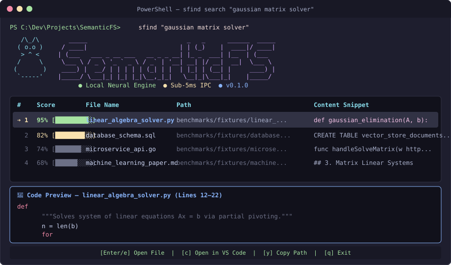

# SemanticFS

> **A Temporal-Associative Terminal Utility & Local Neural Vector Engine for Context-Aware File Retrieval.**

```text
   _____                           _   _      ______  _____ 
  / ____|                         | | (_)    |  ____|/ ____|
 | (___   ___ _ __ ___   __ _ _ __| |_ _  ___| |__  | (___  
  \___ \ / _ \ '_ ` _ \ / _` | '__| __| |/ __|  __|  \___ \ 
  ____) |  __/ | | | | | (_| | |  | |_| | (__| |     ____) |
 |_____/ \___|_| |_| |_|\__,_|_|   \__|_|\___|_|    |_____/ 
```

[](https://github.com/Rioeio/SemanticFS/actions)


---

## Interactive Terminal Interface


*(illustrative mockup — not a live screen capture)*

---

## Release History & Version Comparison

See [VERSIONS.md](docs/VERSIONS.md) for milestone release history and version comparisons across git branches.

---

## Why SemanticFS? (Positioning & Comparison)

SemanticFS is not designed to replace instant filename indexes like Everything or Spotlight — it is built specifically for the scenario where **you do not remember the exact filename or folder structure**.

| Feature / Capability | voidtools Everything | macOS Spotlight / Windows Search | VS Code Workspace Search | SemanticFS |
|---|---|---|---|---|
| **Sub-Millisecond Wildcard Search (`*.pdf`)** | **Instant** | Fast | Fast (Open workspace) | Fast |
| **Conceptual Natural Language ("tax bill 2026")** | No | Partial (Metadata) | No | **Dense Vector AI** |
| **AST Code Function Chunker (`def` / `class`)** | No | No | Partial | **AST-Aware** |
| **Virtual Smart Collections (Zero Disk Risk)** | No | Saved Searches | No | **Explorer Shortcuts** |
| **Multimodal Scene & Scanned OCR Text** | No | PDF Text | No | **CLIP + Tesseract** |

---

## IPC Security & Local Trust Model

* **Local Loopback Socket Isolation**: The background daemon socket server listens **strictly on `127.0.0.1:9876`** (localhost loopback interface only). It does not bind to external network adapters and is inaccessible to network traffic outside your machine.
* **Local Process Trust Model**: The IPC socket trusts local processes executing within the same OS user session. Network egress is 0.0% — zero telemetry or vector data ever leaves your computer.

---

## System Overview

**SemanticFS** eliminates the cognitive friction of hierarchical file system retrieval. Instead of requiring exact folder paths (e.g., `Documents/v1/final.py`), SemanticFS allows users to retrieve files based on ambient activity context, semantic concepts, visual image scenes, printed OCR text, and activity history across all user drive locations.

---

## System Requirements & Operating System Support

| Resource / System | Requirement Specification |
|---|---|
| **Operating System** | **Windows** (Primary; full support for Explorer file highlighting `/select` & Clipboard), Linux/macOS (Supported) |
| **Python Runtime** | **Python 3.11** or newer |
| **System Memory (RAM)** | ~500 MB RAM (BAAI/bge-small-en-v1.5 model + ChromaDB vector index) |
| **Disk Space** | ~134 MB (Embedding model weights) + ~150 MB per 10,000 indexed file chunks |
| **OCR System Binary** | Tesseract OCR (Optional; required only for scanned PDF/image text extraction) |
| **Rust Toolchain** | Cargo / rustc (Optional; required only for standalone `native_core` compilation) |

> [!TIP]
> Run `sfind doctor` anytime to perform an automated environment diagnostic check of all python dependencies, system binaries, and storage path permissions!

> [!NOTE]
> Linux file-reveal (`Enter/e` key) requires an `org.freedesktop.FileManager1`-compatible file manager (e.g., GNOME Files/Nautilus); fallbacks may be needed on other desktop environments.

---

## Storage, Privacy & Security Architecture

### 1. Storage Locations & Disk Formats
All vector indices, extracted document text chunks, metadata, and virtual drive shortcuts are stored strictly within your user profile home directory (`~/.semanticfs/`):

* **Master Vector Store**: `~/.semanticfs/chroma/` (Embedded SQLite database + Apache Parquet vector files).
* **Co-Access Links & Tags**: `~/.semanticfs/links.db` & `~/.semanticfs/collections.json`.
* **Virtual Drive Shortcuts**: `~/.semanticfs/virtual_drive/` (Virtual `.url` shortcut files; zero physical files moved on disk).

> [!NOTE]
> **Encryption at Rest**: Stored unencrypted by default on the local filesystem. Access control relies on OS user account isolation and volume encryption (e.g., BitLocker on Windows, FileVault on macOS).

### 2. 100% Zero Network Egress Guarantee
**No telemetry, metrics, or document content ever leaves your local machine.** All embedding inference (`BAAI/bge-small-en-v1.5`), multimodal vision processing (`CLIP`), and OCR text extraction (`Tesseract`) run 100% locally on your local CPU.

### 3. Background Daemon Resource Footprint
* **Idle Daemon RAM**: ~45 MB.
* **Active Search RAM**: ~350 MB (PyTorch model loaded).
* **Idle CPU Usage**: **0.0% CPU** when no file changes are occurring.
* **Battery Protection**: File watcher employs a 500ms debounce timer and skips rapid indexing loops when running on battery.

### 4. Complete Data Purge & Reset (`sfind purge`)
To completely delete all stored vector indices, cached metadata, and virtual drive shortcut collections:
```bash
sfind purge
```

---

## Core Product Features (Stable & Benchmarked)

- **Local Neural Vector Search (`BAAI/bge-small-en-v1.5`)**: Powered by `BAAI/bge-small-en-v1.5` (a compact, high-throughput 384-dimensional embedding model optimized for local offline vector search) and embedded `ChromaDB`.
- **Sub-5ms Pre-Warmed Socket IPC**: IPC socket server on `127.0.0.1:9876` (`sfind start`) returns pre-warmed memory embeddings in **~3ms - 5ms**.
- **AST Syntax & Header-Aware Semantic Chunker (`semanticfs/ast_chunker.py`)**: Parses Python files strictly by function (`def`) and class (`class`) AST boundaries and Markdown files by `#` headers so code logic is never cut in half mid-function.
- **Full User Space System Coverage (`%USERPROFILE%` / `~`)**: Automatically scans and monitors the entire user directory tree (`Documents`, `Desktop`, `Downloads`, `Pictures`, `Videos`, `Music`, `Dev`, and custom workspaces).
- **16-Worker ThreadPoolExecutor Parallel Scanning**: Multi-threaded parallel file crawler in `daemon.py` indexes workspace files across the system in parallel.
- **Virtual Smart Collections (`sfind collection`)**: Create virtual shortcut folders in File Explorer without moving a single physical file on disk (**Zero Disk Modification Risk**).
- **Structured Search Operators & Sharp Precision Engine**: Pinpoint search using inline operators (`ext:`, `file:`, `in:`, `tag:`, `+must`, `-exclude`, `score:0.5`) alongside 100% natural language search with zero mandatory file format typing.
- **Interactive Terminal Interface**: Arrow-key navigation, live `monokai` syntax-highlighted code preview box, `Enter` to open File Explorer and highlight the selected file, `o` for App launch, `c` for VS Code, and `y`/`p` for Clipboard path/snippet copy.
- **Terminal Folder Jump (`sfind jump <query>`)**: Finds the target file and copies the `cd "/folder/path"` command directly to the Windows Clipboard for instant shell navigation.
- **Semantic Duplicate File Finder (`sfind duplicates`)**: Scans the vector store to identify high-similarity duplicate files across your drive via vector similarity.
- **Custom File Annotations & Tags (`sfind tag <file> <note>`)**: Attach custom semantic notes and tags to any file for boosted retrieval relevance.
- **Recency Weight Decay**: Gives an exponential score boost (+0.10 max) to files modified within the last 48 hours, keeping active work at the top.
- **Universal Format Extraction**: Parses code files, Markdown, TXT, PDF, Word (`.docx`), PowerPoint (`.pptx`), Excel (`.xlsx`), JSON, CSV, and EXIF metadata.
- **Privacy & Offline Isolation**: Operates completely offline with zero telemetry or cloud dependencies.

---

## Roadmap & Experimental Extras

The following features are active in development and available via optional install extras. See [docs/EXPERIMENTAL_ROADMAP.md](docs/EXPERIMENTAL_ROADMAP.md) for empirical quality gates required for promotion to Core:

- **Multimodal CLIP Vision Indexing (`pip install -e ".[vision]"`)**: Integrated HuggingFace Transformers `CLIPModel` (`openai/clip-vit-base-patch32`) for zero-shot image scene classification.
- **Offline OCR Text Extraction Engine (`pip install -e ".[ocr]"`)**: Tesseract / EasyOCR pipeline (`semanticfs/ocr.py`) extracts printed text inside scanned PDFs, receipts, invoices, and screenshots.
- **Local Model Fine-Tuning (`pip install -e ".[train]"`)**: Fine-tune transformer embeddings directly on local codebase vocabulary (`sfind train`).
- **ONNX INT8 Model Quantization (`pip install -e ".[onnx]"`)**: Export PyTorch model weights to quantized ONNX INT8 format (`sfind onnx`).
- **Virtual Drive Mount Engine (`sfind mount`)**: Initializes virtual search shortcut directory at `~/.semanticfs/virtual_drive` for Explorer integration.
- **Git Commit Search (`sfind commit <query>`)**: Search git commit messages across all monitored repositories.

> [!NOTE]
> **Experimental Promotion Policy**: No roadmap feature is promoted to "Core Product" until it passes reproducible accuracy, latency, and regression benchmarks. See [EXPERIMENTAL_ROADMAP.md](docs/EXPERIMENTAL_ROADMAP.md).

> [!TIP]
> **Fun Extra Callout**: Run `sfind model` in your terminal to launch the **3D Movable "Bad Apple!!" ASCII Raycasting Neural Visualizer** (`semanticfs/visualizer.py`) with real-time WASD/Arrow controls, zoom, and mode switching.

---

## Installation & Extras

### Core Installation (Lightweight)
```bash
git clone https://github.com/Rioeio/SemanticFS.git
cd SemanticFS
pip install -e .
```

### Full Installation (With Vision, OCR, ONNX, and Training Extras)
```bash
pip install -e ".[all]"
```

Or selectively install individual feature extras:
```bash
pip install -e ".[vision,ocr]"
```

---

## Structured Search Operators & Precision Guide

For pinpoint search precision, `SemanticFS` supports structured inline query operators alongside natural language:

| Operator Syntax | Purpose & Description | Example Usage |
|---|---|---|
| `ext:pdf` / `ext:py` | Filter strictly by file extension | `sfind "neural network" ext:py` |
| `file:report` / `file:invoice` | Filter by matching filename sub-string | `sfind "budget summary" file:2026` |
| `in:documents` / `in:desktop` | Limit search scope to specific directory folder | `sfind notes in:documents` |
| `tag:note` | Search specifically inside custom user-added file notes | `sfind tag:final` |
| `+term` | Require mandatory keyword matching | `sfind python +dataset` |
| `-term` | Disqualify and exclude any file containing `term` | `sfind AI research -draft` |
| `score:0.5` | Dynamically override the minimum relevance score threshold | `sfind physics score:0.55` |

---

## Command Reference Matrix

### Core Search & Navigation (Stable)
| Command / Option | Description |
|---|---|
| `sfind <query>` | Natural language context search + interactive arrow menu & live code preview |
| `sfind jump <query>` | Find target file & copy `cd /folder/path` command directly to clipboard |
| `sfind recent` | Display 10 most recently modified files across monitored workspaces |
| `sfind duplicates` | Identify high-similarity duplicate files across drive via vector similarity |
| `sfind tag <file> <note>` | Attach custom semantic notes and tags to any file for boosted search |
| `sfind collection create` | Create Virtual Smart Collection shortcuts in Explorer (Zero real files moved) |
| `sfind collection list` | Display all active Virtual Smart Collections and their shortcut rules |

### Daemon & Workspace Management
| Command / Option | Description |
|---|---|
| `sfind start` | Launch pre-warmed background IPC server & tracking daemon for sub-5ms search |
| `sfind stop` | Stop ambient background daemon |
| `sfind status` | Display service status and master vector analytics |
| `sfind reindex` | Force full file re-scan & dynamic vector re-indexing across all user drives |
| `sfind add-dir <path>` | Register a new directory for background indexing |
| `sfind list-dirs` | List all currently monitored workspace directories |

### Experimental & Roadmap Extras
| Command / Option | Description |
|---|---|
| `sfind model` / `sfind visualize` | Launch 3D Movable "Bad Apple!!" ASCII Neural Model Visualizer in terminal |
| `sfind commit <query>` | Search git commit messages across monitored repositories |
| `sfind train` | Fine-tune local neural embedding model on your local files |
| `sfind onnx` | Export model weights to quantized ONNX INT8 format |
| `sfind mount` | Initialize virtual drive search folder for Explorer integration |

---

## Detailed System Architecture

```text
┌────────────────────────────────────────────────────────────────────────────────────────┐
│                                   sfind CLI                                            │
│      (Interactive Arrow Menu / Live Monokai Code Preview / Action Keys / IPC Client)    │
└───────────────────────────┬────────────────────────────────────────────────────────────┘
                            │ (Sub-5ms Socket Query / IPC Port 9876)
            ┌───────────────┴───────────────┐
            ▼                               ▼
  ┌───────────────────────────────────┐           ┌───────────────────────────────────┐
  │   CORE NEURAL VECTOR ENGINE       │           │   VECTOR STORE (ChromaDB + RAM)   │
  │   • BAAI/bge-small-en-v1.5 (384D) │ ────────► │   • 384-Dim Neural Vectors        │
  │   • AST Syntax & Header Chunker   │           │   • Recency Boost (+0.10 Decay)   │
  │   • Structured Query Parser       │           │   • Category Intent Boost (+0.50) │
  └───────────────────────────────────┘           └───────────────────────────────────┘
                    ▲                                               ▲
                    │                                               │
┌───────────────────┴───────────────────────────────────────────────┴───────────────────┐
│              16-Worker ThreadPoolExecutor Parallel Ambient Daemon                      │
│                (Multi-Threaded Scanner & File Watcher / ~/.semanticfs)                │
└───────────────────────────┬───────────────────────────────────────────────────────────┘
                            │
            ┌───────────────┴───────────────┐
            ▼                               ▼
  ┌───────────────────────────────────┐           ┌───────────────────────────────────┐
  │    Virtual Smart Collections      │           │   OPTIONAL FEATURE EXTRAS         │
  │  (Zero Disk Modification Risk)    │           │   • CLIP Vision (pip install .[vision])│
  │  • ~/.semanticfs/virtual_drive    │           │   • Tesseract OCR (pip install .[ocr]) │
  └───────────────────────────────────┘           └───────────────────────────────────┘
```

---

## Native Rust Core Crate (`native_core/`) [Experimental / Planned Integration]

> [!NOTE]
> The native Rust engine crate (`libsemanticfs`) in `native_core/` is currently experimental and standalone (`native_core/Cargo.toml`, `native_core/src/lib.rs`). Python vector search currently utilizes embedded ChromaDB; PyO3 bindings for native Rust core acceleration are planned for Phase 2.

---

## Benchmark Verification & Reproducibility

SemanticFS includes a **reproducible portable benchmark suite** (`benchmarks/run_benchmarks.py`) operating on 10 checked-in test fixtures and 40 held-out evaluation queries:

* **System Scale**: Designed with a 16-worker parallel crawler to scale to **50,000+ files**; benchmarked locally on a **~3,000 chunk** index.
* **Portable Eval Benchmark (`benchmarks/run_benchmarks.py`)**: **95.00% Top-1 Retrieval Accuracy** (38/40 queries matched) on portable held-out test fixtures.
* **Latency Distribution**:
  * **Pre-warmed Socket IPC**: **~3ms - 5ms** single-query response time via background daemon (`sfind start`).
  * **Cold Vector DB Search**: **Mean: 34.34 ms** (Distribution: **p50 = 33.96 ms** | **p95 = 42.41 ms** | **p99 = 52.33 ms**).

To reproduce benchmarks locally:
```bash
python benchmarks/run_benchmarks.py
```

---

## License

Distributed under the MIT License. See [LICENSE](LICENSE) for details.
